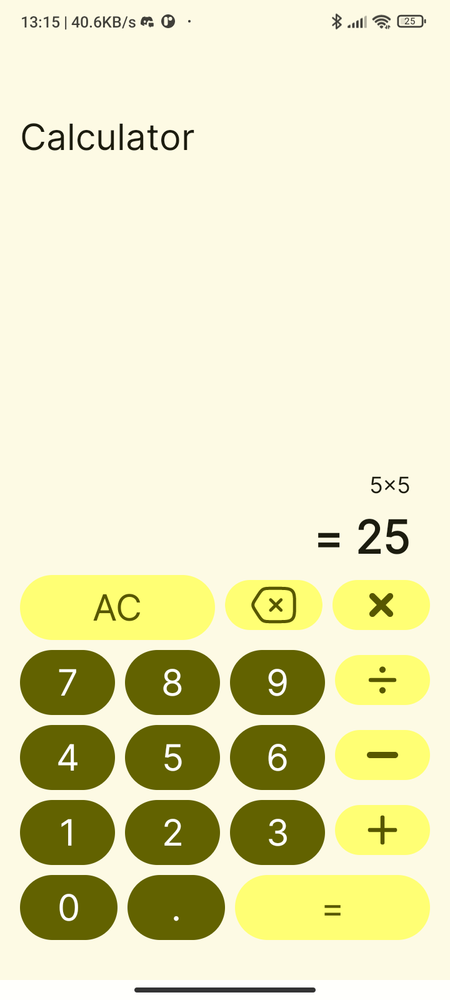
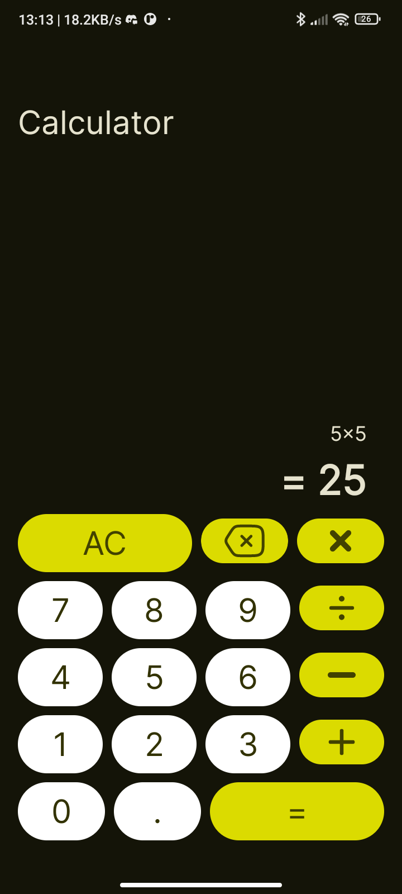

## SumFun

A simple JetPack Compose calculator app.

## Technology stack

- **[Kotlin](https://kotlinlang.org/):** A statically typed programming language that runs on the JVM and the official language for building Android applications.
- **[JetPack Compose](https://developer.android.com/compose):** A toolkit for building UI using kotlinlang
- **[JetPack ViewModel](https://developer.android.com/topic/libraries/architecture/viewmodel):** A life-cycle aware state holder provided by the Android Architecture Components.
- **[Material Design](https://m3.material.io/):** Design system from Google.

## Demo

The APK can be found [here](https://github.com/slowburn-404/PRODIGY_AD_01/releases/tag/v1.0.0).




## Setup instructions

- Clone this git repository into your local machine.

```bash
git clone https://github.com/slowburn-404/PRODIGY_AD_01
```

- Build the project.

```bash
./gradlew build 
```

- Run tests.

```bash
./gradlew test
```
